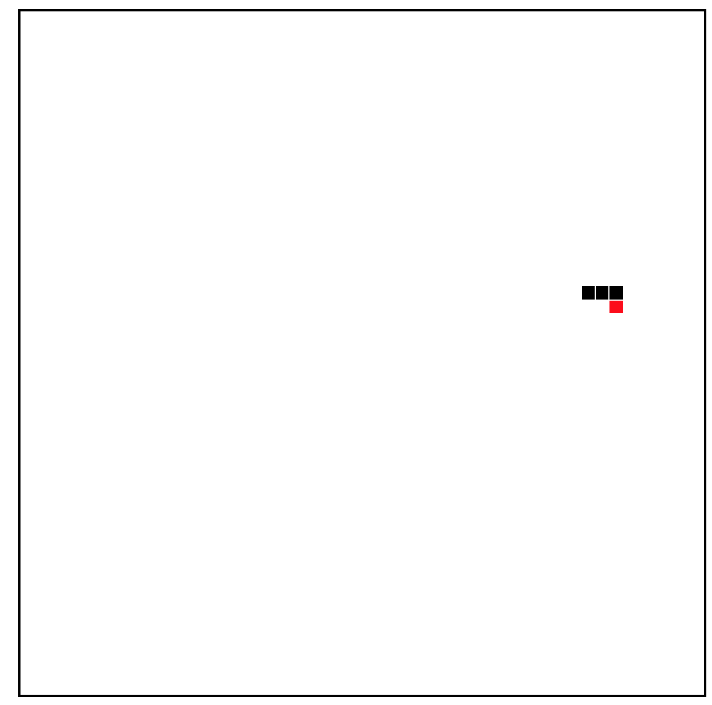

# Screen shot

# Instruction

# Submission

Game URL: **\_**

Mockup URL: **\_**

## How to do the question

- Make a new branch `snake-game`.
- `cd` into `snake-game-react` folder.
- Run `npm install` in the `snake-game-react` folder.
- Run `npm run start` to start the development server.
- You can look at this [page](https://create-react-app.dev/docs/deployment/) for deployment.

# Mandatory Features

- You have to create a **Snake Game** using [`React`](https://reactjs.org/).
- If you don't know the mechanics of the game, here's a [link](https://playsnake.org/). Remember, your game doesn't have to be a copy of this. Only the mechanics are important.
  - Don't try code extra features right now. **Focus on getting the basic flow correct with good user experience.**
- The game should be playable using the 4 arrow keys.
- The game should be able to display a score.
- The game should be deployed on a static web hosting site such as `github.io` or `netlify.com`.
- The UX/UI is totally up to you.
- The game should initially have no backend. Everything should run on the front-end.

# Creating Mockups

- Create a basic mockup before you start writing code for the game
- Use [Balsamiq](https://balsamiq.cloud/) to create Mockups
- Once you are done with the Mockup, click on `Share` on top right and enable `Allow Public Reviews` and copy the link and paste in the README above
- The mockup should have all the major components that would be in the actual game
- Don’t put too much focus on the quality of sketches put just enough details so you’ll be able to review and refine your sketches later
- Sample Mockup, https://balsamiq.cloud/swxx4te/pkp3y50

# Requirements

- The purpose of the exercise is to write good code and have good design.
  - Don't try to finish the implementation. If your game is one large component, you will get 0 points. **Even if your game works.**
- Hence, write readable and maintainable code. It will be reviewed.
- Each component should have relevant tests.
  - As many unit tests and/or integration tests. You can use Enzyme as well if you want.
  - At least one E2E test. You can use [Cypress](https://www.cypress.io/).
- Use React `hooks` and `Context` APIs for the most part.
  - **Don't use `redux`**
  - If you are using a class component, then it **must** have some life-cycle methods that `hooks` cannot do.
- Feel free to use utility libraries like `lodash` or `ramda`. However, any library accomplishing major work of the assignment is prohibited. However, **Try not to use any more utility libraries.** Try to code the utilities yourself.

## Restrictions

- Don't copy paste code from anywhere on the web. We have plagiarism detectors and if we find that you have violated this policy, your candidature will be cancelled immediately without any further deliberation.
- **Try not to use any more utility libraries.** Try to code the utilities yourself.
